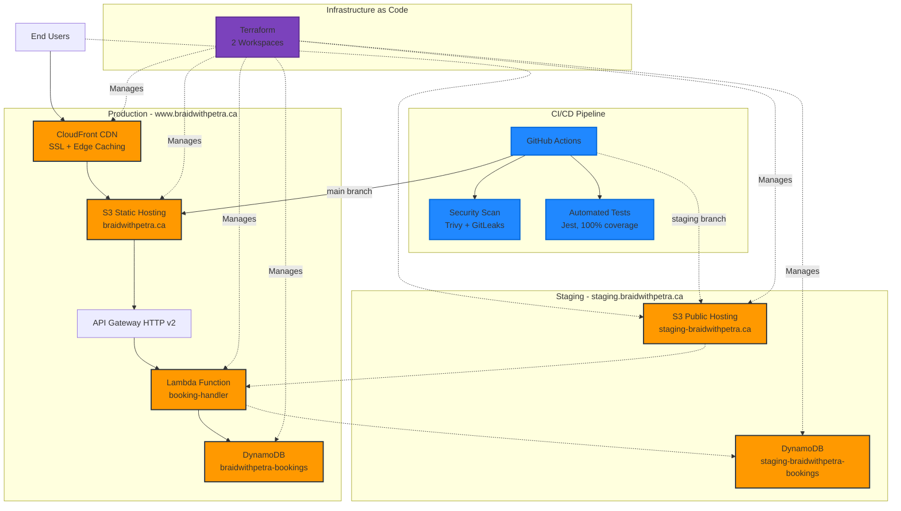

# 💜 Braid with Petra - Production Serverless Platform

A complete serverless booking platform with professional DevOps practices—built as a Valentine's Day gift, evolved into production-grade infrastructure.

**Live Site:** [www.braidwithpetra.ca](https://www.braidwithpetra.ca)  
**Status:** Production ✅ | **Cost:** $0/month 💰

---

## 📊 Project Stats

- **7 unit tests** with 100% coverage
- **2 environments** (staging + production)
- **Automated deployments** via GitHub Actions
- **Zero production bugs** since implementing quality gates
- **28-second** automated deployment pipeline
- **$0/month** infrastructure cost (AWS Free Tier)

---

## 🏗️ Architecture


---

## ✨ Features

### 🌐 Production Website
- Beautiful gradient design with professional photo gallery
- Online booking form with real-time validation
- WhatsApp & TikTok integration
- Mobile responsive (100/100 SEO score)
- Global CDN delivery via CloudFront

### 🔒 Security
- Automated vulnerability scanning (Trivy)
- Secret detection (GitLeaks)
- IAM least-privilege policies
- HTTPS/SSL encryption

### 🧪 Quality Assurance
- 100% test coverage on Lambda functions
- Automated HTML validation
- Mocked AWS SDK for fast, isolated testing
- Tests block deployment on failure

### 🚀 DevOps
- **Multi-environment:** Staging + Production isolation
- **GitOps workflow:** Branch protection, PR templates, automated checks
- **CI/CD:** Automated deployments via GitHub Actions
- **IaC:** Terraform with workspace-based configuration
- **Monitoring:** CloudWatch dashboards tracking Lambda, DynamoDB, CloudFront

---

## 🛠️ Tech Stack

**Frontend:**
- HTML5, CSS3, JavaScript
- S3 Static Hosting + CloudFront CDN

**Backend:**
- AWS Lambda (Node.js 20.x)
- DynamoDB (On-Demand)
- API Gateway (HTTP API v2)

**Infrastructure:**
- Terraform (multi-workspace IaC)
- GitHub Actions (CI/CD)
- CloudWatch (monitoring)

**Testing:**
- Jest (unit tests)
- html-validate (structural validation)

**Security:**
- Trivy (vulnerability scanning)
- GitLeaks (secret detection)

---

## 🔄 Development Workflow

### Making Changes
```bash
# 1. Create feature branch
git checkout -b feature/your-feature

# 2. Make changes and test locally
cd lambda-booking && npm test

# 3. Push and create PR
git push -u origin feature/your-feature

# 4. Automated checks run
#    - Security scanning
#    - Unit tests (must pass)
#    - HTML validation

# 5. Merge to staging for testing
# 6. Merge to main for production
```

### Deployment Flow
```
staging branch → Staging Environment → Test → main branch → Production
```

**All deployments automated. Tests must pass before deployment.**

---

## 🧪 Running Tests

**Lambda unit tests:**
```bash
cd lambda-booking
npm test                  # Run tests
npm run test:coverage     # With coverage report
```

**HTML validation:**
```bash
npm run test:html
```

**All tests:**
```bash
npm run test:all
```

---

## 📊 Monitoring

**CloudWatch Dashboard:** [Braid-Production-Metrics](https://console.aws.amazon.com/cloudwatch/home?region=ca-central-1#dashboards/dashboard/Braid-Production-Metrics)

**Metrics tracked:**
- Lambda: Invocations, Duration (p99), Errors, Throttles
- DynamoDB: Read/Write Capacity
- CloudFront: Requests, 4xx/5xx Errors

**Auto-refresh:** 1 minute

---

## 🌍 Environments

### Production
- **URL:** https://www.braidwithpetra.ca
- **Branch:** `main`
- **S3:** braidwithpetra.ca
- **CloudFront:** Enabled (global CDN)
- **DynamoDB:** braidwithpetra-bookings
- **Lambda:** braidwithpetra-booking-handler

### Staging
- **URL:** http://staging-braidwithpetra.ca.s3-website.ca-central-1.amazonaws.com
- **Branch:** `staging`
- **S3:** staging-braidwithpetra.ca (public access)
- **CloudFront:** Disabled (cost optimization)
- **DynamoDB:** staging-braidwithpetra-bookings
- **Lambda:** Shared with production

---

## 📁 Project Structure
```
braid-with-petra/
├── .github/
│   ├── workflows/
│   │   └── deploy.yml              # CI/CD pipeline
│   └── pull_request_template.md    # PR template
├── docs/
│   ├── testing.md                   # Testing documentation
│   ├── deployment-workflow.md       # Deployment guide
│   ├── staging-environment.md       # Multi-env architecture
│   └── monitoring.md                # CloudWatch setup
├── lambda-booking/
│   ├── index.js                     # Lambda handler
│   ├── index.test.js                # Unit tests (7 tests)
│   └── package.json
├── terraform/
│   ├── main.tf                      # Infrastructure definitions
│   ├── variables.tf                 # Workspace configurations
│   └── outputs.tf
├── tests/
│   └── html-validation.test.js      # HTML validation
├── index.html                       # Main website
├── CONTRIBUTING.md                  # Contribution guide
└── README.md
```

---

## 📚 Documentation

- [Testing Documentation](docs/testing.md) - Test suite details
- [Deployment Workflow](docs/deployment-workflow.md) - CI/CD process
- [Staging Environment](docs/staging-environment.md) - Multi-environment setup
- [Monitoring Setup](docs/monitoring.md) - CloudWatch dashboards
- [Contributing Guide](CONTRIBUTING.md) - Development workflow

---

## 🚀 Key Technical Decisions

### Why Terraform Workspaces?
Manage multiple environments from single codebase. Production and staging share infrastructure code but maintain isolated resources.

### Why Mock AWS SDK in Tests?
- Fast execution (3 seconds vs network calls)
- No test data in production tables
- Deterministic behavior

### Why No CloudFront for Staging?
Staging is for testing functionality, not performance. CloudFront requires SSL certificates—unnecessary complexity for internal testing environment.

### Why 100% Coverage?
50-line Lambda function with single responsibility. Uncovered code paths = untested production behavior. Pragmatic for scope.

---

## 💰 Cost Breakdown

| Service | Production | Staging | Cost |
|---------|-----------|---------|------|
| S3 | ✅ | ✅ | $0 |
| CloudFront | ✅ | ❌ | $0 |
| Lambda | ✅ | Shared | $0 |
| DynamoDB | ✅ | ✅ | $0 |
| **Total** | | | **$0/month** |

*All services within AWS Free Tier limits*

---

## 🎯 Skills Demonstrated

**DevOps:**
- Infrastructure as Code (Terraform)
- CI/CD Pipeline Design
- Multi-Environment Strategy
- GitOps Workflow
- Security Automation

**Cloud Engineering:**
- AWS Serverless Architecture
- Cost Optimization
- Monitoring & Observability
- IAM Security

**Quality Engineering:**
- Automated Testing (100% coverage)
- Test-Driven Development
- Quality Gates
- Code Review Automation

---

## ❤️ The Story

Started as a Valentine's Day gift (14 days, 14 features, $0 cost).

Evolved into production-grade infrastructure with professional DevOps practices:
- **Week 1:** Infrastructure as Code migration
- **Week 2:** Multi-environment deployment
- **Week 3:** Automated testing + quality gates
- **Week 4:** GitOps workflow

Valentine's gift that became a portfolio piece. 💝

---

## 📈 Performance

- **Lighthouse SEO:** 100/100 ⭐
- **Desktop Performance:** 89/100
- **Mobile Performance:** 61/100
- **Deployment Time:** 28 seconds (automated)
- **Test Execution:** 3 seconds (unit tests)
- **Production Bugs:** 0 (since automated testing)

---

## 🤝 Contributing

See [CONTRIBUTING.md](CONTRIBUTING.md) for development workflow and guidelines.

---

## 📄 License

Built with 💜 by Junior Neba
